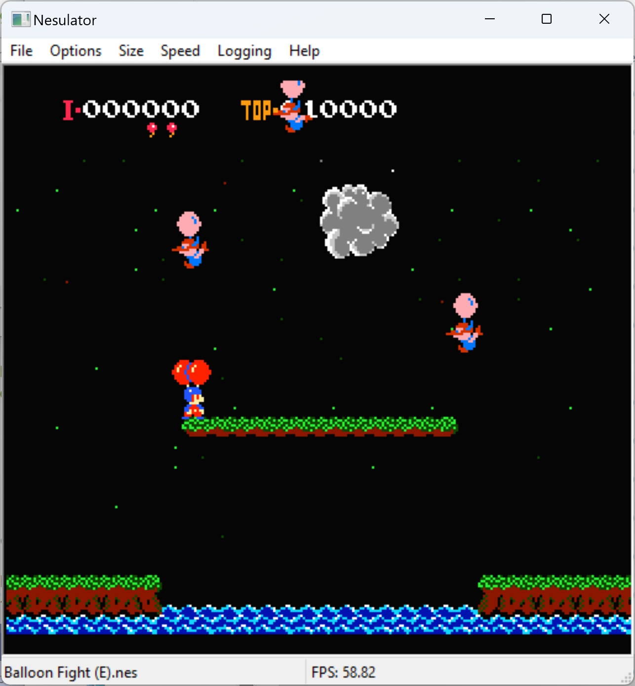
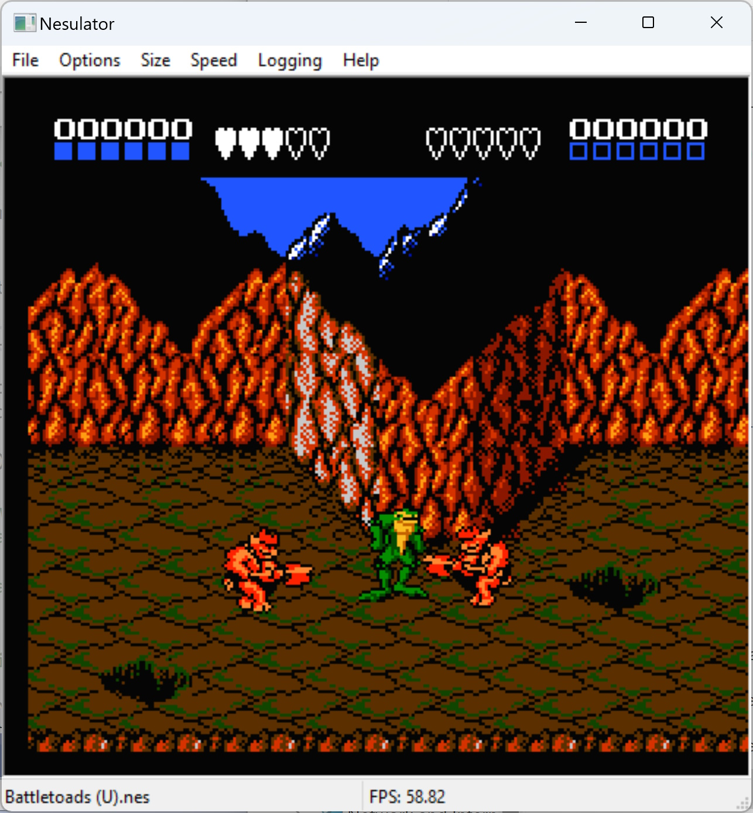
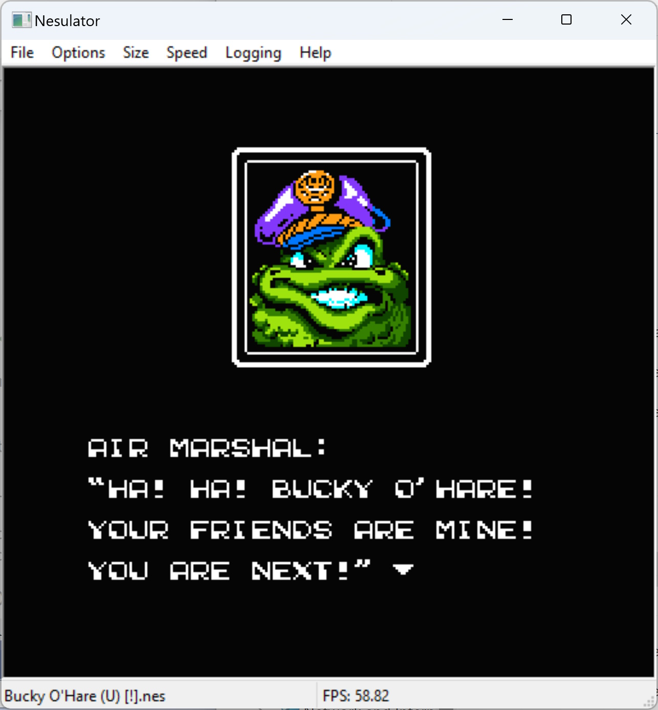
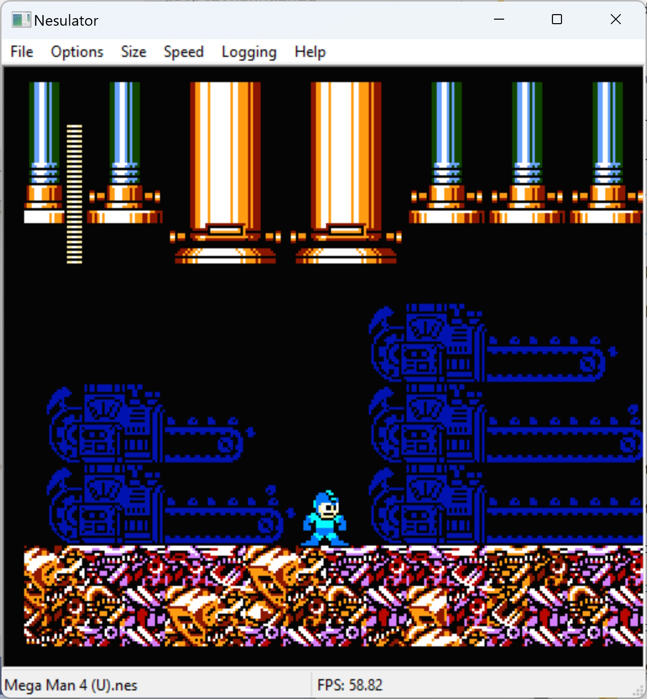

# nesulator

C++ NES emulator for Windows.

Supports most of the popular mappers, this is mainly here for educational purposes.

# Screenshots

## Balloon Fight

## Battletoads

## Bucky O'Hare

## Megaman 4

# Build

You will need to have Visual Studio 2022, wxWidgets 3.2.2.1, boost 1.81.0 and SDL development environments setup to build.

Builds of SDL2 and SDL_Sound are in the build folder. These were built from SDL2 2.27.0 and SDL_Sound 2.0.1.0, and built from the GitHub sources on 26.3.2023
